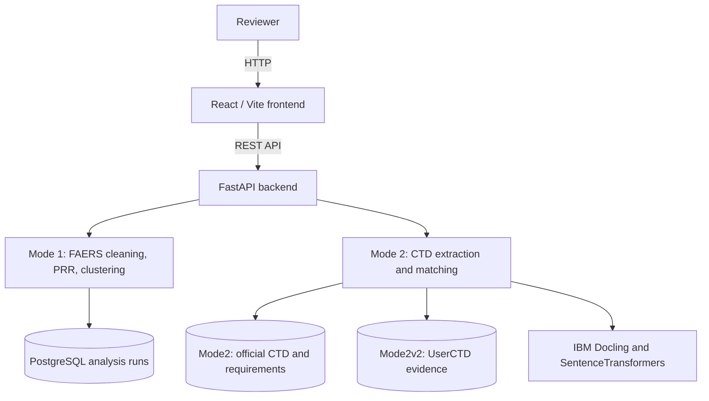

# Architecture

## System Architecture

ReguLens has separate React frontends for its safety-signal and CTD-readiness workflows. FastAPI services perform ingestion and analysis; Mode 1 persists analysis runs in PostgreSQL, while Mode 2 keeps official regulatory evidence and applicant CTD evidence in separate MongoDB databases.

## Components

| Component | Technology | Responsibility |
|---|---|---|
| Mode 1 frontend | React, Vite | Uploads and presents FAERS safety-signal analysis. |
| Mode 2 frontend | React, Vite | Manages CTD submissions, evidence, reports, modules, and gaps. |
| Backend API | FastAPI | Provides REST endpoints and orchestrates ingestion and analysis. |
| Mode 1 analysis | pandas, scikit-learn, optional Gemini summaries | Cleans safety data, calculates PRR, and clusters candidate signals. |
| Mode 2 analysis | PyMuPDF, IBM Docling, SentenceTransformers | Extracts CTD PDF evidence, chunks it by heading, and matches it to requirements. |
| Data stores | PostgreSQL, MongoDB Atlas | Persists Mode 1 runs and separates official Mode 2 evidence from applicant UserCTD evidence. |

## Data Flow

1. A reviewer uploads FAERS CSV data in Mode 1 or official/applicant PDF documents in Mode 2.
2. Mode 1 cleans records, calculates PRR values, clusters events, and persists completed analysis runs.
3. Mode 2 extracts PDF page text and detected headings with PyMuPDF and IBM Docling, then records page and section provenance with every evidence chunk.
4. Official CTD requirements are read from `Mode2.CTD_REQUIREMENTS`; applicant chunks are read from `Mode2v2.UserCTD` for the selected submission.
5. The matcher ranks applicant chunks against each requirement, calculates module and overall scores, creates a gap register, and saves the report.
6. The frontend requests the resulting report, module, gap, and evidence endpoints for the review workspace.

## Security Considerations

- Secrets and database connection strings are read from environment files or process environment variables; they should not be committed to version control.
- Mode 1 uses HTTP Basic authentication for its API routes, with credentials configured through environment variables.
- Mode 2 uploads accept PDF files and retain source-file hashes and page references for evidence traceability.

## Scalability Notes

The FastAPI services can be deployed as stateless API processes behind a load balancer. For large dossier collections, background ingestion jobs, a managed queue, Atlas vector-search capacity, and cached or batched embeddings would reduce request latency and isolate long-running PDF processing from the web API.
